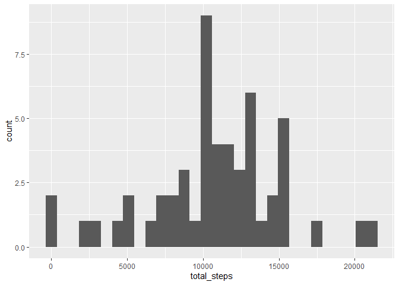
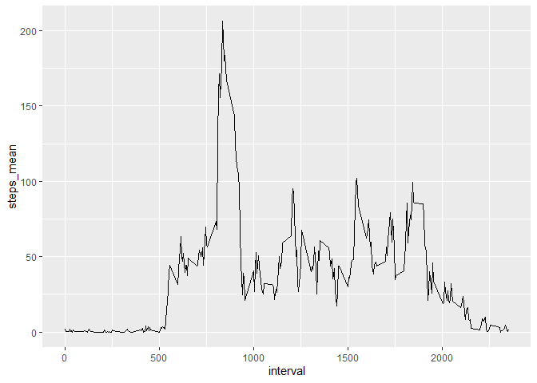
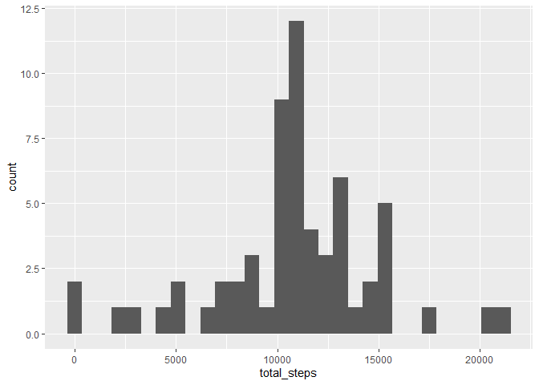
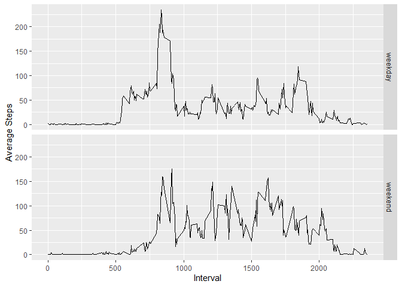

## Loading and preprocessing the data
Checking and unzipping file.


```r
if(file.exists("activity.csv")){
  message("Data file found.")
} else if(file.exists("activity.zip")){
  unzip("activity.zip")  
} else {
  message("Data file and zip file not found.")
}
```

```
## Data file found.
```


Loading data into data frame, re-classing date column from "character" to "date", and display summary information of the data set.


```r
data_activity <- read.csv("activity.csv")
data_activity$date <- as.Date(data_activity$date)
summary(data_activity)
```

```
##      steps             date               interval     
##  Min.   :  0.00   Min.   :2012-10-01   Min.   :   0.0  
##  1st Qu.:  0.00   1st Qu.:2012-10-16   1st Qu.: 588.8  
##  Median :  0.00   Median :2012-10-31   Median :1177.5  
##  Mean   : 37.38   Mean   :2012-10-31   Mean   :1177.5  
##  3rd Qu.: 12.00   3rd Qu.:2012-11-15   3rd Qu.:1766.2  
##  Max.   :806.00   Max.   :2012-11-30   Max.   :2355.0  
##  NA's   :2304
```

Loading packages that will be used:

```r
library(dplyr)
library(ggplot2)
```

Good to go...!


## What is mean total number of steps taken per day?
For this part of the assignment, you can **ignore the missing values** in the dataset.

### a. Calculate the total number of steps taken per day

```r
total_per_day <- data_activity %>%
  group_by(date) %>%
  summarize(total_steps = sum(steps)) %>%
  arrange(date)

total_per_day
```

```
## # A tibble: 61 x 2
##    date       total_steps
##    <date>           <int>
##  1 2012-10-01          NA
##  2 2012-10-02         126
##  3 2012-10-03       11352
##  4 2012-10-04       12116
##  5 2012-10-05       13294
##  6 2012-10-06       15420
##  7 2012-10-07       11015
##  8 2012-10-08          NA
##  9 2012-10-09       12811
## 10 2012-10-10        9900
## # ... with 51 more rows
```

### b. Make a histogram of the total number of steps taken each day

```r
ggplot(total_per_day, aes(x = total_steps)) +
    geom_histogram()
```

```
## `stat_bin()` using `bins = 30`. Pick better value with `binwidth`.
```

```
## Warning: Removed 8 rows containing non-finite values (stat_bin).
```

<!-- -->

### c. Calculate and report the mean and median of the total number of steps taken per day.
(with NA values removed)

```r
total_mean <- mean(total_per_day$total_steps, na.rm = TRUE)

total_median <- median(total_per_day$total_steps, na.rm = TRUE)
```
With missing values removed, the mean of total steps taken per day is **1.0766189\times 10^{4}**, and median is **10765**.


## What is the average daily activity pattern?

### a. Make a time series plot (i.e. type = "l") of the 5-minute interval (x-axis) and the average number of steps taken, averaged across all days (y-axis)

First, compute average steps for each 5-minute interval across all days.

```r
interval_avg_steps <- data_activity %>%
  group_by(interval) %>%
  summarize(steps_mean = mean(steps, na.rm = TRUE))
```

Next, draw time series (type = "l", i.e. line graph) of average steps taken throughout the day.

```r
ggplot(interval_avg_steps, aes(x = interval, y = steps_mean)) +
  geom_line()
```

<!-- -->

### b. Which 5-minute interval, on average across all the days in the dataset, contains the maximum number of steps?

```r
max_steps_mean <- interval_avg_steps %>% top_n(1, wt = steps_mean)
max_steps_mean
```

```
## # A tibble: 1 x 2
##   interval steps_mean
##      <int>      <dbl>
## 1      835       206.
```
The 5-minute interval containing the maximum number of steps is 835, which has an average step of 206.1698113.


## Imputing missing values

### a. Calculate and report the total number of missing values in the dataset (i.e. the total number of rows with NAs)

```r
#Number of NAs in "steps" column:
sum(is.na(data_activity$steps))
```

```
## [1] 2304
```
There are 2304 rows of missing values.


### b. Devise a strategy for filling in all of the missing values in the dataset.
First, take a look at where the missing values are located.

```r
# Create a new data frame with all observations containing NA
data_missing <- data_activity %>%
  filter(is.na(steps) == TRUE)
```

Aggregate the number of NAs across dates.

```r
data_missing %>% count(date)
```

```
##         date   n
## 1 2012-10-01 288
## 2 2012-10-08 288
## 3 2012-11-01 288
## 4 2012-11-04 288
## 5 2012-11-09 288
## 6 2012-11-10 288
## 7 2012-11-14 288
## 8 2012-11-30 288
```

As shown in the output, the number of NAs are  uniformly distributed across date. It seems that when observations are missing, it's the entire day's data that's missing.

Furthermore, it seems that November accounts for 6 out of 8 missing dates in the dataset, but there is no other particular patterns here.

Since NAs are uniformly distributed across dates and there is no significant patterns in missing dates, we will simply **substitute NAs with average steps for each corresponding interval**.


### c. Create a new dataset that is equal to original dataset but with the missing data filled in.


```r
# Create another data frame to store data with NAs removed
data_activity_NA_removed <- data_activity

# Average steps, rounding to whole numbers
avg_steps <- round(interval_avg_steps$steps_mean, digits = 0)

# Store missing dates in vector
missing_dates <- unique(data_missing$date)

# Construct a for Loop, with each cycle subsetting the associated missing dates and replaced with avg_steps across the intervals

for(i in 1:length(missing_dates)){
  data_activity_NA_removed[data_activity_NA_removed$date == missing_dates[i], 1] <- avg_steps
}
```


### d. Make a histogram of the total number of steps taken each day and calculate and report the **mean** and **median** total number of steps taken per day.

Using the new activity dataset with NAs removed, aggregate total steps by date and create histogram:

```r
# Aggregate total steps by date
total_per_day_NArm <- data_activity_NA_removed %>%
  group_by(date) %>%
  summarize(total_steps = sum(steps))

#Plot histogram
ggplot(total_per_day_NArm, aes(x = total_steps)) +
    geom_histogram()
```

```
## `stat_bin()` using `bins = 30`. Pick better value with `binwidth`.
```

<!-- -->

Next, calculate mean and median of total steps:

```r
result <- total_per_day_NArm %>% summarize(mean_steps = mean(total_steps), median_steps = median(total_steps))
result
```

```
## # A tibble: 1 x 2
##   mean_steps median_steps
##        <dbl>        <dbl>
## 1     10766.        10762
```

As shown in the above result, mean of total steps is 1.0765639\times 10^{4}, and median is 1.0762\times 10^{4}.


## Are there differences in activity patterns between weekdays and weekends?

### a. Create a new factor variable in the dataset with two levels -- "weekday" and "weekend" indicating whether a given date is a weekday or weekend day.

```r
# Craete simple function that returns "weekend" or "weekday" depending on input of date
weekday_or_end <- function(date){
  if(weekdays(date) %in% c("Saturday", "Sunday")){
    "weekend"
  } else {
    "weekday"
  }
}

# Simple for loop to apply to each element of date, store in weekend_vector
weekend_vector <- NULL
for(i in 1:nrow(data_activity)){
  weekend_vector[i] <- weekday_or_end(data_activity$date[i])
}

# Add new variable (weekday) to the original data set
data_activity$weekday <- weekend_vector
```


### b. Make a panel plot containing a time series plot (i.e. type = "l") of the 5-minute interval (x-axis) and the average number of steps taken, averaged across all weekday days or weekend days (y-axis).
(Using original dataset, i.e. containing NAs)


```r
mean_steps_weekday <- data_activity %>%
  group_by(interval, weekday) %>%
  summarize(mean_steps = mean(steps, na.rm = TRUE))

ggplot(mean_steps_weekday, aes(interval, mean_steps)) +
  geom_line() +
  facet_grid(rows = vars(weekday)) +
  xlab("Interval") +
  ylab("Average Steps")
```

<!-- -->


